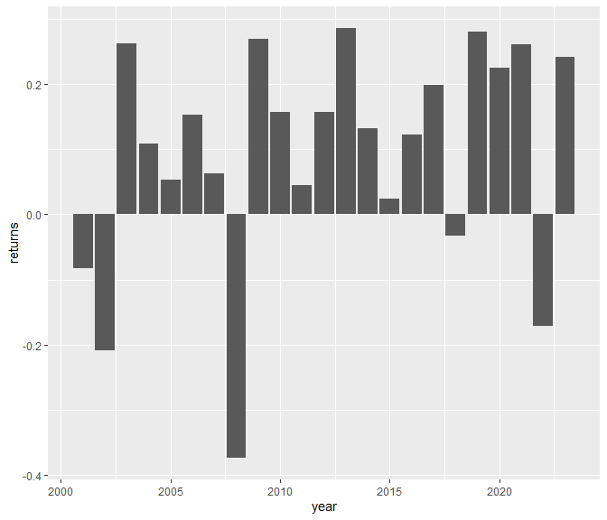

workshop2
================
Sathwika
2024-04-06

- [Statistics on stock returns](#statistics-on-stock-returns)
- [Plot 1](#plot-1)
- [Plot 2](#plot-2)

## Statistics on stock returns

``` r
wk2_stocks <- readRDS("wk2_stocks.rds")
df = wk2_stocks
mean(df$SPY_returns)
```

    ## [1] 0.0003765616

``` r
sd(df$SPY_returns)
```

    ## [1] 0.01221943

- The cumulative returns of the S&P index during this period is 218.33%.
- The average daily returns of the S&P index during this period is
  0.04%.
- The standard deviation of the daily returns of the S&P index during
  this period is 1.22%.

## Plot 1

``` r
library(tidyverse)
```

    ## ── Attaching core tidyverse packages ──────────────────────── tidyverse 2.0.0 ──
    ## ✔ dplyr     1.1.2     ✔ readr     2.1.4
    ## ✔ forcats   1.0.0     ✔ stringr   1.5.0
    ## ✔ ggplot2   3.4.3     ✔ tibble    3.2.1
    ## ✔ lubridate 1.9.2     ✔ tidyr     1.3.0
    ## ✔ purrr     1.0.2     
    ## ── Conflicts ────────────────────────────────────────── tidyverse_conflicts() ──
    ## ✖ dplyr::filter() masks stats::filter()
    ## ✖ dplyr::lag()    masks stats::lag()
    ## ℹ Use the conflicted package (<http://conflicted.r-lib.org/>) to force all conflicts to become errors

``` r
ggplot(df,aes(x = date, y =SPY_prices))+
  geom_line()
```

<!-- -->

## Plot 2

``` r
df%>%
  mutate(year = year(date))%>%
  filter(year <= 2023)%>%
  group_by(year)%>%
  summarise(returns = sum(SPY_returns)) %>%
ggplot(aes(x = year, y = returns))+
  geom_col()
```

<!-- -->

Note that the `echo = FALSE` parameter was added to the code chunk to
prevent printing of the R code that generated the plot.
